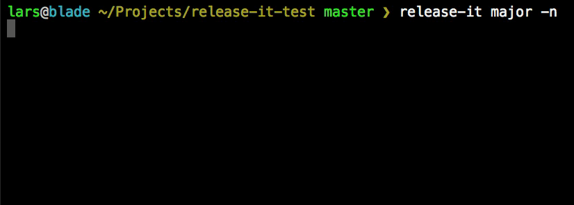

# Release It!

Advanced release tool for Git repos and npm packages.



If all you need is the following, you probably don't need this tool:

```
npm version patch
git push
npm publish
```

Also see [npm-version](https://docs.npmjs.com/cli/version) for extra `script`-ing options.

However, if you also want some of the following in a convenient tool:

* Create GitHub releases (send changelog to https://github.com/webpro/release-it/releases)
* Upload assets to GitHub release
* Push to a distribution repository or branch (e.g. `gh-pages`) with a release.

...then you should definitely give release-it a shot!

## Usage

Release a new patch (increments from e.g. `1.0.4` to `1.0.5`):

```bash
release-it
```

Release a patch, minor, major, or specific version:

```bash
release-it minor
release-it 0.8.3
```

Create a pre-release using `prerelease`, `prepatch`, `preminor`, or `premajor`:

```bash
release-it premajor --prereleaseId="beta"
release-it premajor
```

The first example would increment from e.g. `1.0.6` to `2.0.0-beta.0`, the second from `2.0.0-beta.0` to `2.0.0-beta.1`.

See [node-semver](https://github.com/npm/node-semver#readme) for more details.

You can also do a "dry run", which won't write/touch anything, but does output the commands it would execute, and show the interactivity:

```bash
release-it --dry-run
```

For automation and CI purposes, you can use the "non-interactive" mode:

```bash
release-it --non-interactive
```

## Configuration

**Release It** can do a lot out-of-the-box, but has plenty of options to configure it. The basics:

```
$ release-it --help
Release It! v3.0.0-beta.3
  
  Usage: release-it <increment> [options]
  
  Use e.g. "release-it minor" directly as shorthand for "release-it --increment=minor".
  
  -c --config            Path to local configuration options [default: ".release.json"]
  -d --dry-run           Do not touch or write anything, but show the commands
  -f --force             Allow empty Git commit, force tag.
  -h --help              Print this help
  -i --increment         Increment "major", "minor", "patch", or "pre*" version; or specify version [default: "patch"]
  -m --message           Commit message [default: "Release %s"]
  -n --non-interactive   No questions asked.
     --prereleaseId      Identifier for pre-releases (e.g. "beta" in "1.0.0-beta.1")
  -v --version           Print version number
  -V --verbose           Verbose output
```

All default settings can be overridden with a config file: put a `.release.json` file in the project root, and it will be picked up. You can use `--config` if you want to use another path for this file.

Options can also be set on the command-line (these will have highest priority). Example:

```bash
release-it minor --src.tagName='v%s' --github.release
```

Here is the full list of default settings:

```json
{
  "non-interactive": false,
  "dry-run": false,
  "verbose": false,
  "force": false,
  "pkgFiles": ["package.json"],
  "increment": "patch",
  "prereleaseId": null,
  "buildCommand": false,
  "changelogCommand": "git log --pretty=format:\"* %s (%h)\" [REV_RANGE]",
  "requireCleanWorkingDir": false,
  "src": {
    "commit": true,
    "commitMessage": "Release %s",
    "tag": true,
    "tagName": "%s",
    "tagAnnotation": "Release %s",
    "push": true,
    "pushRepo": null,
    "beforeStartCommand": false,
    "afterReleaseCommand": false
  },
  "npm": {
    "publish": true,
    "publishPath": ".",
    "tag": "latest",
    "private": false,
    "access": null
  },
  "github": {
    "release": true,
    "releaseName": "Release %s",
    "preRelease": false,
    "draft": false,
    "tokenRef": "GITHUB_TOKEN",
    "assets": false
  },
  "dist": {
    "repo": false,
    "stageDir": ".stage",
    "baseDir": "dist",
    "files": ["**/*"],
    "pkgFiles": null,
    "commit": true,
    "commitMessage": "Release %s",
    "tag": false,
    "tagName": "%s",
    "tagAnnotation": "Release %s",
    "push": true,
    "beforeStageCommand": false,
    "afterReleaseCommand": false,
    "github": {
      "release": false
    },
    "npm": {
      "publish": false
    }
  },
  "prompt": {
    "src": {
      "status": false,
      "commit": true,
      "tag": true,
      "push": true,
      "release": true,
      "publish": true
    },
    "dist": {
      "status": false,
      "commit": true,
      "tag": false,
      "push": true,
      "release": false,
      "publish": false
    }
  }
}
```

Notes:

* While e.g. `npm.publish` represents whether or not to publish in _non-interactive_ mode, `prompt.src.publish` represents the default value (`Y/N`) in _interactive_ mode.
* In the background, some steps of the `dist.repo` process are actually executed before you are asked to commit anything (in the source repo), so you know about build, clone, or copy issues as soon as possible.
* The `"private": true` setting in package.json will be respected and the package won't be published to npm.
* If `src.pushRepo` is `false`, the default `git push` is used when pushing to the remote.
Otherwise, it's the url or name of a remote as in `git push <src.pushRepo>`.

### Command Hooks

The command hooks are executed from the root directory of the `src` or `dist` repository, respectively:

* `src.beforeStartCommand`
* `buildCommand` - before files are staged for commit
* `src.afterReleaseCommand`
* `dist.beforeStageCommand` - before files are staged in dist repo
* `dist.afterReleaseCommand`

All commands can use configuration variables (like template strings):

```bash
"buildCommand": "tar -czvf foo-${src.tagName}.tar.gz ",
"afterReleaseCommand": "echo Successfully released ${version} to ${dist.repo}."
```

## Distribution Repository

Some projects use a special distribution repository. There might be multiple reasons to do so:

* Distribute more "clean" file structures (without unrelated test, manifest, documentation files etc.).
* Distribute to target specific package managers. An example is the shims repositories in
[https://github.com/components](https://github.com/components) (the actual source files are elsewhere).
* Distribute to a Github Pages branch. Also see [Using GitHub Pages, the easy way](https://medium.com/@webprolific/using-github-pages-the-easy-way-bb7acc46f45b).

Notes:

* To release to a separate "distribution repo", set `dist.repo` to a git endpoint (e.g. `"git@github.com:components/ember.git"`).
* Note that this can also be a branch (also of the same source repository) using `#` notation (e.g. `"git@github.com:webpro/release-it.git#gh-pages"`).

## GitHub

### SSH keys & git remotes

The tool assumes you've configured your SSH keys and remotes correctly.
In case you need to configure things for GitHub, the following pages might be of help.

* GitHub Help: [SSH](https://help.github.com/articles/connecting-to-github-with-ssh/)
* GitHub Help: [Managing Remotes](https://help.github.com/categories/managing-remotes/)

### GitHub Release

To create [GitHub releases](https://help.github.com/articles/creating-releases/),
you'll need to set `github.release` to `true`,get a [GitHub access token](https://github.com/settings/tokens),
and make this available as the environment variable defined with `github.tokenRef`. You can set it like this:

```bash
export GITHUB_TOKEN="f941e0..."
```

In non-interactive mode, the release is created only for the source repository.

## Credits

Major dependencies:

* [ShellJS](http://documentup.com/shelljs/shelljs)
* [Inquirer.js](https://github.com/SBoudrias/Inquirer.js)
* [node-github](https://github.com/mikedeboer/node-github)

The following Grunt plugins have been a source of inspiration:

* [grunt-release](https://github.com/geddski/grunt-release)
* [grunt-release-component](https://github.com/walmartlabs/grunt-release-component)

## Why YA...

Why did I need to create yet another "release" tool/plugin? I think this tool stands out:

* As a user-friendly, stand-alone CLI tool.
* Making it simple to release the current project you're working at.
* Working without any configuration, but also provides many options.
* Releasing a separate distribution repository (in a single run).
* Being as quiet or verbose as you want it to be.

## License

[MIT](http://webpro.mit-license.org/)
