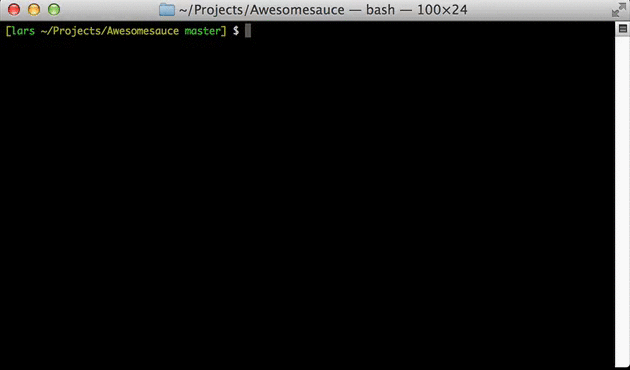

# Release It!

Interactive release tool for Git repositories. Publish to npm. Optionally build and release to a distribution/component repository.

Automatically increments version in package.json, commit, tag, push, publish, done.



Obviously, **Release It** has released itself. Cool, heh?! There's also a [Grunt plugin](https://github.com/webpro/grunt-release-it).

## Install

```shell
npm install release-it -g
```

Personally, I prefer to alias it to `release`:

```shell
alias release="release-it"
```

The examples below assume this alias to be defined.

## Configuration

**Release It** can do a lot out-of-the-box, but has plenty of options to configure it.

### Help

```
$ release --help
Release It! v0.1.3

Usage: release <increment> [options]

Use e.g. "release minor" directly as shorthand for "release --increment=minor".

Options:
  -c, --config           Path to local configuration options [default: ".release.json"]                          
  -d, --dry-run          Do not touch or write anything, but show the commands and interactivity                 
  -e, --debug            Output exceptions                                                                       
  -f, --force            Force tagging with Git                                                                  
  -h, --help             Print help                                                                              
  -i, --increment        Incrementing "major", "minor", or "patch" version; or specify version [default: "patch"]
  -n, --non-interactive  No interaction (assume default answers to questions)                                    
  -p, --publish          Publish to npm (only in --non-interactive mode)                                         
  -v, --version          Print version number                                                                    
  -V, --verbose          Verbose output
```

### Default Settings

```js
{
    "non-interactive": false,
    "dry-run": false,
    "verbose": false,
    "force": false,
    "pkgFiles": ["package.json"],
    "increment": "patch",
    "commitMessage": "Release %s",
    "tagName": "%s",
    "tagAnnotation": "Release %s",
    "buildCommand": false,
    "distRepo": false,
    "distPkgFiles": undefined, /* Defaults to pkgFiles */
    "distStageDir": ".stage",
    "distBase": "dist",
    "distFiles": ["**/*"],
    "private": false,
    "publish": false,
    "publishPath": ".",
    "githubTokenRef": "GITHUB_TOKEN",
    "githubRelease": false,
    "githubReleaseName": "Release %s",
    "githubReleaseBodyCommand": "git log --pretty=format:'* %s (%h)' [REV_RANGE]"
}
```

### Distribution Repository

Some projects use a special distribution repository.

There might be multiple reasons to do.

* Distribute more "clean" file structures (without unrelated test, manifest, documentation files etc.).
* Distribute to target specific package managers (without any test files). One example is the "shims" repositories in [https://github.com/components](https://github.com/components).

To release to a separate "distribution repo", you'll need to set `distRepo` to a git endpoint (e.g. `"git@github.com:webpro/awesome-component.git"`).

### GitHub

#### SSH keys & git remotes

The tool assumes you've configured your SSH keys and remotes correctly. In case you need to configure things for GitHub, the following pages might be of help.

* GitHub Help: [SSH](https://help.github.com/categories/56/articles)
* GitHub Help: [Managing Remotes](https://help.github.com/categories/18/articles)

#### GitHub release

To create [GitHub releases](https://help.github.com/articles/creating-releases/), you'll need to set `githubRelease` to `true`, get a [GitHub access token](https://github.com/settings/tokens), and make this available as the environment variable defined with `githubTokenRef`. With the default settings, you could set it like this:

```shell
export GITHUB_TOKEN="f941e0..."
```

### Local overrides

Place a `.release.json` file in your project root, and **Release It** will use it to overwrite default settings. You can use `--config` if you want to use another filename/location. Most options can be set on the command-line (these will have highest priority).

## What it does

Many steps need your confirmation before execution.

By default, with the current repository:

1. The version in each of the `pkgFiles` will be incremented.
1. This change will be committed with `commitMessage`.
1. This commit is tagged with `tagName` (and `tagAnnotation`). The `%s` is replaced with the incremented version.
1. Both the commit and tag are pushed.
1. The version can be released on GitHub (with `githubReleaseName` and output of `githubReleaseBodyCommand`).
1. Without a configured `distRepo`, the package can be published directly to npm.

Additionally, if a distribution repository is configured:

1. The plugin will create the distribution build using the `distBuildTask` shell command.
1. The `distRepo` is cloned in `distStageDir`.
1. The `distFiles` are copied here (normalized by removing the `distBase` from the target path).
1. Steps 1-5 above are executed for the distribution repository.
1. The distribution package can be published to npm.

If present, your `"private": true` setting in package.json will be respected and you will not be bothered with the question to publish to npm.

## Usage examples

Release a "patch" update (increments the `x` in `0.0.x` by one):

```shell
release
```

Release a patch, minor, major, or specific version:

```shell
release minor
release 0.8.3
release 2.0.0-rc.3
```

You can also do a dry run, which won't write/touch anything, but does output the commands it would execute, and show the interactivity:

```shell
release --dry-run
```

If you don't like questions and trust the tool, you can use the `non-interactive` mode:

```shell
release --non-interactive
```

Provide a custom name for the GitHub release:

```shell
release --githubReleaseName="Awesome Ants"
```

## Credits

Major dependencies:

* [ShellJS](http://documentup.com/arturadib/shelljs)
* [Inquirer.js](https://github.com/SBoudrias/Inquirer.js)
* [node-github](https://github.com/mikedeboer/node-github)

The following Grunt plugins have been a source of inspiration:

* [grunt-release](https://github.com/geddski/grunt-release)
* [grunt-release-component](https://github.com/walmartlabs/grunt-release-component)

Why did I need to create yet another "release" tool/plugin? I think it..

* Should be a stand-alone CLI tool.
* Should be simple to release the current project you're working at.
* Should allow to release a separate distribution repository.
* Should be as quiet or verbose as you want it to be.

## License

[MIT](http://webpro.mit-license.org/)


