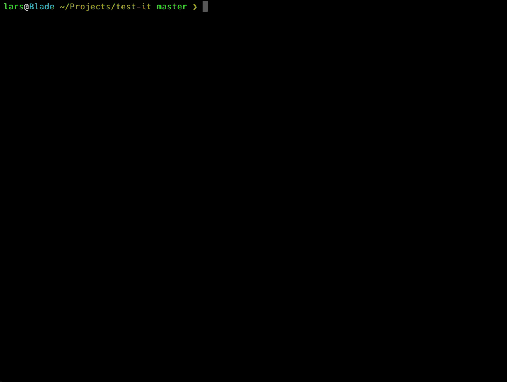

Pre-releases let you ship a version of your software that shouldn't yet appear in the stable
semver range. Common identifiers are `alpha`, `beta`, and `rc` (release candidate). Example
version: `2.0.0-beta.0`.

## The typical flow

Say `awesome-pkg` is at `1.3.0` and you're working on a new major. To publish the first beta:

```bash
release-it major --preRelease=beta
```

This tags and releases `2.0.0-beta.0`. Behaviour:

- A normal `npm install awesome-pkg` still resolves to `1.3.0`.
- The [npm dist-tag](https://docs.npmjs.com/cli/dist-tag) is `beta` — install explicitly with
  `npm install awesome-pkg@beta`.
- The [GitHub release](/release-it/guides/publishing/github-releases/) is marked as a pre-release.

The above is a shortcut for:

```bash
release-it premajor --preReleaseId=beta --npm.tag=beta --github.preRelease
```

## Iterating on a pre-release channel

Ship consecutive betas (`2.0.0-beta.1`, `2.0.0-beta.2`, …):

```bash
release-it --preRelease
```

Move to the next phase, e.g. `2.0.0-rc.0`:

```bash
release-it --preRelease=rc
```

Cut the stable `2.0.0`:

```bash
release-it major
```



## Including all commits since the last stable tag

When you go from `2.0.0-rc.5` to `2.0.0`, the changelog should cover every commit since the
_previous major_ — not just since `-rc.5`. Use `--git.tagExclude` to skip pre-release tags when
looking up the latest version:

```bash
release-it major --git.tagExclude='*[-]*'
```

`*[-]*` matches any tag containing `-`, which is the convention for pre-releases.

## Branching pre-releases

Suppose the latest release was `2.0.0-rc.0` and you've added new features you don't want in the
`2.0` GA. Cut a `2.1.0-alpha.0` line:

```bash
release-it preminor --preRelease=alpha
```

## Starting numbering at 1 instead of 0

`--preReleaseBase=1` starts the pre-release counter at `1` — the earlier example becomes
`2.0.0-beta.1` instead of `2.0.0-beta.0`:

```bash
release-it major --preRelease=beta --preReleaseBase=1
```

## Notes

- Pre-releases compose with [conventional-changelog recommended
  bumps](https://github.com/release-it/conventional-changelog).
- Individual options can still be overridden, e.g.
  `release-it --preRelease=rc --npm.tag=next`.
- Refresh your semver: [semver.org](http://semver.org).
