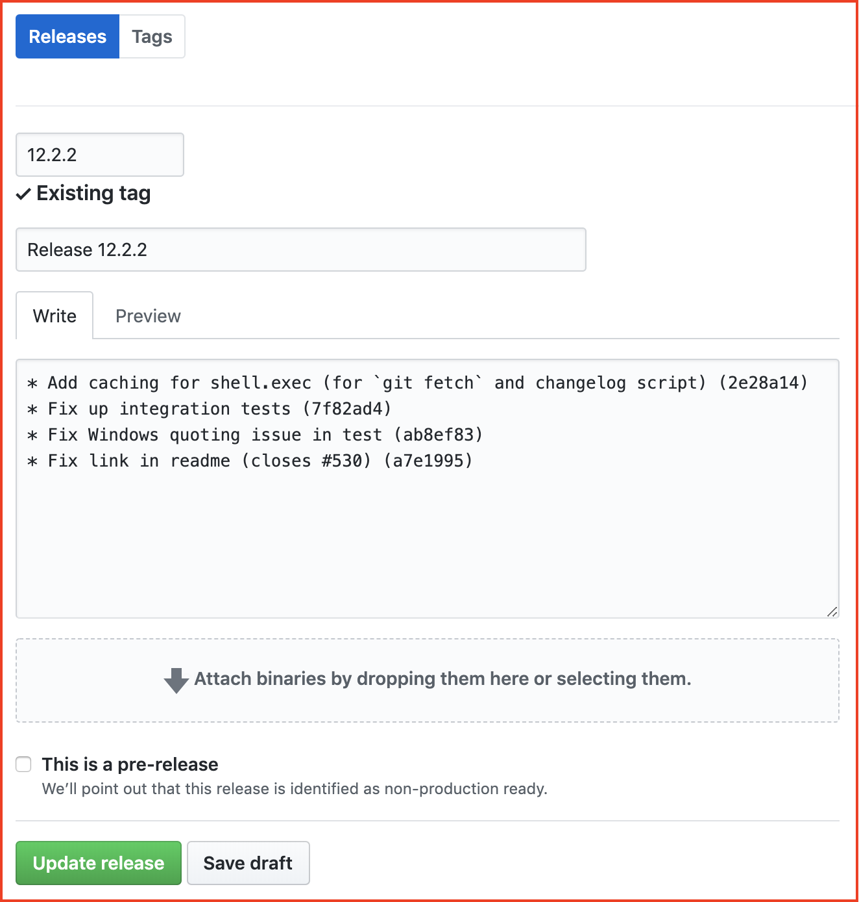

The "Releases" tab on a GitHub project links to the project's version history — a mix of
changelog and downloadable assets. Releases are attached to a Git tag, so make sure the
[Git guide](/release-it/guides/publishing/git/) is set up correctly first.

release-it uses this feature [extensively for itself](https://github.com/release-it/release-it/releases).



Two ways to publish a
[GitHub release](https://docs.github.com/en/repositories/releasing-projects-on-github/about-releases):

1. **Automated** — via the GitHub REST API. Needs a personal access token.
2. **Manual** — release-it opens the GitHub web UI with the fields pre-populated.

For the full list of `github.*` options, see
[Configuration options → GitHub](/release-it/reference/configuration-options/github/).

## Automated

Set up:

1. Set `github.release: true`.
2. Create a
   [personal access token](https://github.com/settings/tokens/new?scopes=repo&description=release-it)
   — release-it only needs `repo`; no admin scopes.
3. Make the token
   [available as an environment variable](/release-it/guides/core-workflow/environment-variables/).

Never put the token in the config file — release-it reads it from `GITHUB_TOKEN`. To use a
different variable name, override `github.tokenRef`.

Optionally, release-it can [notify contributors](#comments) on merged PRs and closed issues.

## Manual

In manual mode, release-it opens your default browser at the GitHub web UI with the fields
pre-populated (as in the screenshot above). You can edit them and attach assets before
publishing.

- Set `github.release: true`.
- Manual mode is enabled automatically if `GITHUB_TOKEN` isn't set.
- Force manual mode with `github.web: true`.
- Let GitHub write release notes with `github.autoGenerate: true`.

In non-interactive CI mode (`--ci` or auto-detected), release-it prints the URL instead of
opening the browser.

## Git prerequisite

A GitHub release needs the corresponding Git tag on the remote — release-it creates and pushes
it. In addition to `GITHUB_TOKEN`, you'll need push access to the repository (via SSH or an
HTTPS token). See [Git remotes](/release-it/guides/publishing/git/#git-remotes) and
[CI Git setup](/release-it/guides/ci/environments/#git).

## Prerequisite checks

release-it verifies `GITHUB_TOKEN` is set. If not, it falls back to [manual mode](#manual) and
skips the remaining checks. If the token is set, release-it authenticates and confirms you're a
collaborator with permission to publish.

Skip these checks with `github.skipChecks`.

## Release name

Default: `Release ${version}`. Override on the fly:

```bash
release-it --github.releaseName="Arcade Silver"
```

## Release notes

By default, `git.changelog` becomes the release notes. Override for GitHub only with
`github.releaseNotes` — evaluated just before the release call.

`github.releaseNotes` accepts a **string** (shell command, must print to `stdout`), a
**function** (only in `.release-it.js` / `.cjs`), or an **object** (template + Octokit fetch).

### String

```json
{
  "github": {
    "release": true,
    "releaseNotes": "generate-release-notes.sh --from=${latestTag} --to=${tagName}"
  }
}
```

Skip merge commits:

```json
{
  "github": {
    "release": true,
    "releaseNotes": "git log --no-merges --pretty=format:\"* %s %h\" ${latestTag}...main"
  }
}
```

### Function

```js
{
  github: {
    release: true,
    releaseNotes(context) {
      // Remove the first, redundant line (version and date).
      return context.changelog.split('\n').slice(1).join('\n');
    }
  }
}
```

Use `--github.autoGenerate` to let GitHub write the notes instead (not compatible with
`web: true`).

### Object

Fetch commits via Octokit and render each with a template:

```json
{
  "github": {
    "releaseNotes": {
      "commit": "* ${commit.subject} (${sha}){ - thanks @${author.login}!}",
      "excludeMatches": ["webpro"]
    }
  }
}
```

`${place.holder}` interpolates values. Blocks wrapped in `{ … }` render only if every
placeholder resolves and no value matches `excludeMatches`.

Sample template context (excerpt):

```json
{
  "sha": "2e8c8ac6...",
  "commit": {
    "author":    { "name": "Lars Kappert", "email": "lars@webpro.nl", "date": "2025-01-06T21:15:33Z" },
    "committer": { "name": "Lars Kappert", "email": "lars@webpro.nl", "date": "2025-01-06T21:15:33Z" },
    "message":   "Add platform-specific entries to metro plugin",
    "url":       "https://api.github.com/repos/webpro-nl/knip/git/commits/2e8c8ac6..."
  },
  "html_url":   "https://github.com/webpro-nl/knip/commit/2e8c8ac6...",
  "author":     { "login": "webpro", "id": 456426, "html_url": "https://github.com/webpro" },
  "committer":  { "login": "webpro", "id": 456426 },
  "parents":    []
}
```

The GitHub plugin adds `commit.subject` (the first line of `commit.message`).

Full schema: [REST API: Compare two
commits](https://docs.github.com/en/rest/commits/commits?apiVersion=2022-11-28#compare-two-commits).

## Attach binary assets

Provide one or more glob patterns via `github.assets`:

```json
{
  "github": {
    "release": true,
    "assets": ["dist/*.zip"]
  }
}
```

Assets appear on the release page for download.

## Immutable releases

GitHub repositories and organizations can enable [release
immutability](https://docs.github.com/en/code-security/how-tos/secure-your-supply-chain/establish-provenance-and-integrity/preventing-changes-to-your-releases),
which locks a release's tag and assets once published. release-it handles this by publishing in
two steps when assets are present: create a draft, upload assets, then publish. Assetless
releases publish in one step.

## Pre-release

If the version is a pre-release (per semver), release-it sets `github.preRelease` to `true`
automatically. You can also set it manually.

## Draft

Prevent the release from being public with:

```json
{
  "github": {
    "draft": true
  }
}
```

## GitHub Enterprise host

Override the derived API host — say for GitHub Enterprise:

```json
{
  "github": {
    "host": "private.example.org"
  }
}
```

Default API is [https://api.github.com](https://api.github.com); with `github.host` set,
release-it hits `https://<host>/api/v3`.

## Behind a proxy

```json
{
  "github": {
    "proxy": "http://proxy:8080"
  }
}
```

## Update the latest release

To edit an existing release (notes, assets, draft toggle) without cutting a new version:

- `--no-increment` — don't bump the version.
- `--no-git` — skip Git commit, tag, push (assumes the tag already exists).
- `--no-npm` — skip publishing to npm.
- `--github.update` — enable update mode.

Example: add assets and un-draft:

```bash
release-it --no-increment --no-git --github.release --github.update --github.assets=*.zip --no-github.draft
```

Note: `draft` and `preRelease` default to `false` — set explicitly with `--github.draft` /
`--no-github.draft`.

## Not the latest release

For a support / back-port release that shouldn't become "latest":

```json
{
  "github": {
    "makeLatest": false
  }
}
```

## Auto-create a GitHub Discussion

```json
{
  "github": {
    "discussionCategoryName": "Announcements"
  }
}
```

## Comments

Notify contributors on merged PRs and closed issues:

```json
{
  "github": {
    "comments": {
      "submit": true
    }
  }
}
```

Defaults:

```json
{
  "github": {
    "comments": {
      "submit": false,
      "issue": ":rocket: _This issue has been resolved in v${version}. See [${releaseName}](${releaseUrl}) for release notes._",
      "pr":    ":rocket: _This pull request is included in v${version}. See [${releaseName}](${releaseUrl}) for release notes._"
    }
  }
}
```

Example rendered comment:

\:rocket: _This issue has been resolved in v15.10.0. See [Release
15.10.0](https://github.com/release-it/release-it/releases/tag/15.10.0) for release notes._

This only works with `github.release: true` (not with [manual releases](#manual)).
